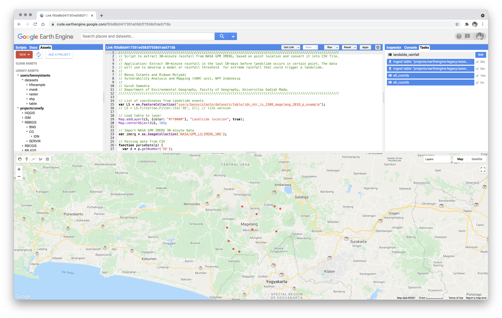
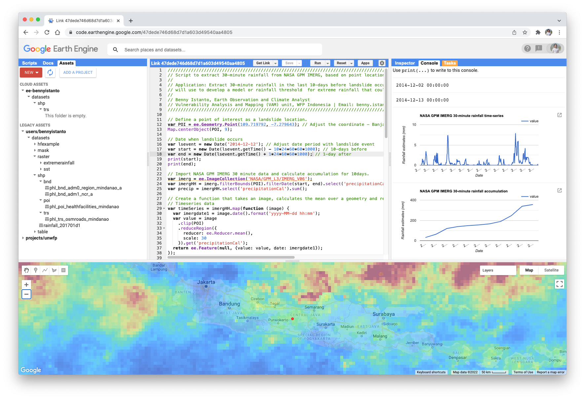

# Half-hourly IMERG rainfall during landslide event

This is a fork repository from https://github.com/wfpidn/landslide-rainfall which originally developed during my service with WFP, and since I left the agency this guideline no longer maintained. So I will continue to update this at my personal Github repo.

------------

During 2018, landslide dominated natural disasters occurred in Central Java. The Regional Disaster Management Agency (BPBD) of Central Java Province recorded that there were about 2,000 landslides in this area.

Most landslide is preceeded by continuous extreme rainfall for few days, as most of the area isn't located near ground weather station, therefore rainfall records are often not available.

Recent development in opendata allows more access to high resolution climate/weather data and to computing platform that allows users to run geospatial analysis in the cloud. This leads to further exploration like never before.

Open access to 30 mins temporal rainfall data at [Google Earth Engine](https://earthengine.google.com/) platform provided detail information on rainfall intensity prior to the landslide. Such information help advancing research on rainfall model or identification of threshold for extreme rainfall that could trigger a landslide.


## Data Source

Half hourly IMERG at Earth Engine Data Catalogue - [https://developers.google.com/earth-engine/datasets/catalog/NASA_GPM_L3_IMERG_V06](https://developers.google.com/earth-engine/datasets/catalog/NASA_GPM_L3_IMERG_V06)

Landslide event in Magelang, Central Java - Indonesia during 2018. Compiled by Department of Environmental Geography, Faculty of Geography - Universitas Gadjah Mada. Available in CSV format with column structure: ID, Lon, Lat, Day, DD, MM, YYYY, TimeWIB. Link: [Landslide](./data/idn_nhr_ls_3308_magelang_2018_p_example.csv)


## Script

### Multipoint simulation

The script below describe how to extract 30-minute rainfall from NASA [GPM-IMERG](https://gpm.nasa.gov/GPM), based on points location and convert it into CSV file using Google Earth Engine code editor.

``` js
//////////////////////////////////////////////////////////////////////////////////////////////////////////////////
// Script to extract 30-minute rainfall from NASA GPM IMERG, based on points location and convert it into CSV file. 
//
// Application: Extract 30-minute rainfall in the last 10-days before landslide occurs in certain point. The data
// will use to develop a model or rainfall threshold  for extreme rainfall that could trigger a landslide.
//
// Benny Istanto and Ridwan Mulyadi
// Vulnerability Analysis and Mapping (VAM) unit, WFP Indonesia
// 
// Guruh Samodra
// Department of Environmental Geography, Faculty of Geography, Universitas Gadjah Mada. 
//////////////////////////////////////////////////////////////////////////////////////////////////////////////////

// List of coordinates from Landslide events
var LS = ee.FeatureCollection("users/bennyistanto/datasets/table/idn_nhr_ls_3308_magelang_2018_p_example");
// LS = LS.filter(ee.Filter.lte('ID', 2)); // lite version

// Load table to layer
Map.addLayer(LS, {color: "#ff0000"}, "Landlside location", true);
Map.centerObject(LS, 11);

// Import NASA GPM IMERG 30 minute data 
var imerg = ee.ImageCollection('NASA/GPM_L3/IMERG_V06');

// Parsing date from CSV
function parseDate(p) {
  var d = p.getNumber('DD');
  var m = p.getNumber('MM');
  var y = p.getNumber('YYYY');
  var dt = y.format('%d')
    .cat('-').cat(m.format('%02d'))
    .cat('-').cat(d.format('%02d'));
  return ee.Date(dt);
}

var result = LS.map(function(p) {
  var id = p.getNumber('ID');
  var point = p.geometry();
  var coord = point.coordinates();
  var dt = parseDate(p);
  var start = dt.advance(-10, 'days'); // 10-days before
  var end = dt.advance(1, 'days'); // 1-day after
  var precipHH = imerg.filterBounds(point)
    .filterDate(start, end)
    .select('precipitationCal');
  var timeSeries = precipHH.map(function(image) {
    var date = image.date().format('yyyy-MM-dd hh:mm');
    var value = image
      .clip(point)
      .reduceRegion({
        reducer: ee.Reducer.mean(),
        scale: 30
      }).get('precipitationCal'); 
    return ee.Feature(null, { 
      coord_id: id, 
      lon: coord.get(0), 
      lat: coord.get(1),
      date: date, 
      value: value
    });
  });
  return timeSeries;
});

var flatResult = ee.FeatureCollection(result).flatten();

// Export the result as CSV in Google Drive
Export.table.toDrive({
  collection: flatResult,
  description:'landslide_rainfall',
  folder:'GEE',
  selectors: 'coord_id, lon, lat, date, value', 
  fileFormat: 'CSV'
});
```

GEE [link](https://code.earthengine.google.com/b7ccc8291d23770301e96a22bd1be2c8)



### Single point simulation

GEE script for 1 point simulation also have been developed. You need to fill coordinate (line 12) and set the landslide date (line 16)

```js
//////////////////////////////////////////////////////////////////////////////////////////////////////////////////
// Script to extract 30-minute rainfall from NASA GPM IMERG, based on point location and convert it into CSV file. 
//
// Application: Extract 30-minute rainfall in the last 10-days before landslide occurs in certain point. The data
// will use to develop a model or rainfall threshold  for extreme rainfall that could trigger a landslide.
//
// Benny Istanto, Earth Observation and Climate Analyst
// Vulnerability Analysis and Mapping (VAM) unit, WFP Indonesia | Email: benny.istanto@wfp.org
//////////////////////////////////////////////////////////////////////////////////////////////////////////////////

// Define a point of interest as a landslide location.
var POI = ee.Geometry.Point(109.719792, -7.279643); // Adjust the coordinate - Banjarnegara 12 Dec 2014
Map.centerObject(POI, 9);

// Date when landslide occurs
var lsevent = new Date('2014-12-12'); // Adjust date period with landslide event
var start = new Date(lsevent.getTime() - 10*24*60*60*1000); // 10-days before
var end = new Date(lsevent.getTime() + 1*24*60*60*1000); // 1-day after
print(start);
print(end);

// Import NASA GPM IMERG 30 minute data and calculate accumulation for 10days.
var imerg = ee.ImageCollection('NASA/GPM_L3/IMERG_V06');
var imergHH = imerg.filterBounds(POI).filterDate(start, end).select('precipitationCal');
var precip = imergHH.select('precipitationCal').sum();

// Create a function that takes an image, calculates the mean over a geometry and returns the value and the corresponding date as a feature.
// Timeseries data
var timeSeries = imergHH.map(function (image) {
  var imergdate1 = image.date().format('yyyy-MM-dd hh:mm');
  var value = image
    .clip(POI)
    .reduceRegion({
      reducer: ee.Reducer.mean(),
      scale: 30
    }).get('precipitationCal');
  return ee.Feature(null, {value: value, date: imergdate1});
});

// Accumulation data
// Based on input from Daniel Wiell via GIS StackExchange
// https://gis.stackexchange.com/questions/360611/extract-time-series-rainfall-from-multiple-point-with-date-information/
var days = ee.Date(end).difference(ee.Date(start), 'days');
var dayOffsets = ee.List.sequence(1, days);
var accumulation = dayOffsets.map(
  function (dayOffset) {
    var endDate = ee.Date(start).advance(ee.Number(dayOffset), 'days');
    var image = imergHH.filterDate(start, endDate).sum();
    var date = endDate.advance(-1, 'days').format('yyyy-MM-dd');
    var value = image
      .clip(POI)
      .reduceRegion({
        reducer: ee.Reducer.mean(),
        geometry: POI,
        scale: 30
      }).get('precipitationCal');
    return ee.Feature(null, {value: value, date: date});
  });


// Create a graph of the time-series.
var graphTS = ui.Chart.feature.byFeature(timeSeries,'date', ['value']);
print(graphTS.setChartType("LineChart")
           .setOptions({title: 'NASA GPM IMERG 30-minute rainfall time-series',
                        vAxis: {title: 'Rainfall estimates (mm)'},
                        hAxis: {title: 'Date'}}));

// Create a graph of the accumulation.
var graphAcc = ui.Chart.feature.byFeature(accumulation,'date', ['value']);
print(graphAcc.setChartType("LineChart")
           .setOptions({title: 'NASA GPM IMERG 30-minute rainfall accumulation',
                        vAxis: {title: 'Rainfall estimates (mm)'},
                        hAxis: {title: 'Date'}}));


// Rainfall vis parameter
var palette = [
  '000096','0064ff', '00b4ff', '33db80', '9beb4a',
  'ffeb00', 'ffb300', 'ff6400', 'eb1e00', 'af0000'
];
var precipVis = {min: 0.0, max: 1000.0, palette: palette, opacity:0.5};


// Add layer into canvas
Map.addLayer(precip, precipVis, "10-days rainfall", false);
Map.addLayer(POI, {color: "#ff0000"}, "Landlside location", true);


// Export the result to Google Drive as a CSV.
Export.table.toDrive({
  collection: timeSeries,
  description:'LS_69421',
  folder:'GEE',
  selectors: 'date, value', 
  fileFormat: 'CSV'
});

// End of script
```

GEE [link](https://code.earthengine.google.com/47dede746d68d7d1a603d49540aa4805)



## Output

30-minutes of rainfall that occurred 10-days before landslide. Generated using GEE, link: [Landslide Rainfall](./data/landslide_rainfall.csv)


## About

This is part of research and development of threshold for extreme rainfall that could trigger a landslide event in Indonesia. Reference: [https://bennyistanto.github.io/ERM/ls/#extreme-rainfall-triggered-landslide-alert](https://bennyistanto.github.io/ERM/ls/#extreme-rainfall-triggered-landslide-alert)

Developed with my former colleague Ridwan Mulyadi at WFP, and Guruh Samodra, Dr. Eng. from Department of Environmental Geography, Faculty of Geography, Universitas Gadjah Mada.